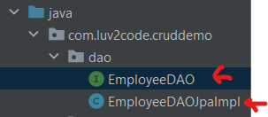
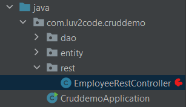
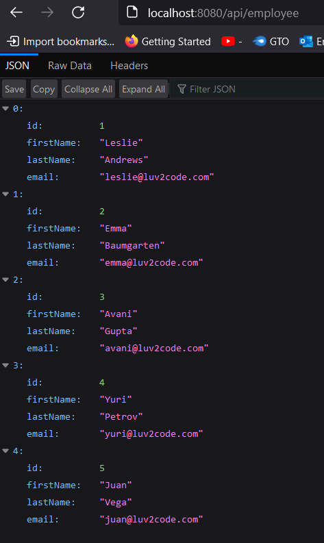
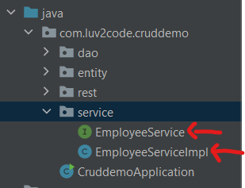
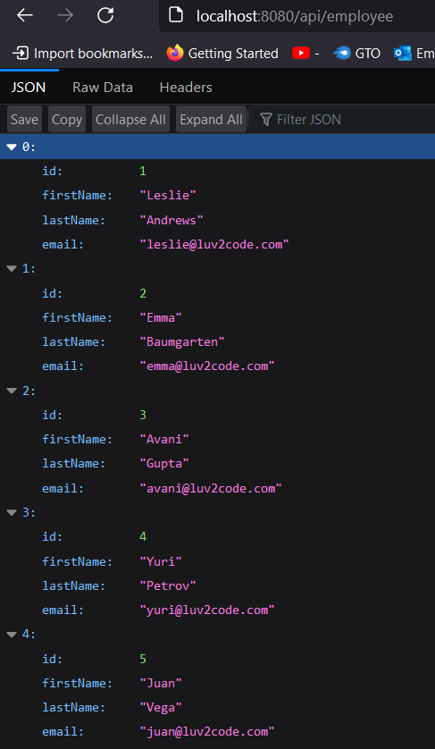

<link rel="stylesheet" href="styles.css">

# Project information
* I started this project on 23/07/2023 while working through [Chad Darby's Spring and Hibernate Course](https://www.udemy.com/course/spring-hibernate-tutorial/)
* You can find my main repo for this course [here](https://github.com/shivkumar98/Spring_and_Hibernate_Course)

# 🛠️ Project Requirements 🛠️

* For this project, I needed to create a RESTful API which connects to a database. Here are the requirements:
* We need to create a REST API for the Employee directory

* The API must be able to handle the following HTTP methods:

| HTTP Method                         | CRUD Action            |
| ---------------------------------   | ------------------------ |
| `POST` `/api/employees`             | Create a new employee  |
| `GET` `/api/employees`              | Retrieve employees     |
| `GET` `/api/employees/{employeeId}` | Retrieve an employee via ID |
| `PUT` `/api/employees/{employeeId}` | Update and employee via ID |


# 📈 Development Plan 📈

1) Set up database dev environment
2) Create Spring Boot project using Spring Initialzr
3) Get list of employees
4) Get single employee via ID
5) Create a new employee
6) Update an existing employee
7) Delete an existoing employee

* I have been provided sample data from [employee-directory.sql](/sample-data/employee-directory.sql)


# 📝 Project Commentary 📝

## 🟦 1 Setup Sample Data

* I install MySQL + Workbench, I connect to my Local Instance and run the SQL script:

```sql
CREATE DATABASE  IF NOT EXISTS `employee_directory`;
USE `employee_directory`;

--
-- Table structure for table `employee`
--

DROP TABLE IF EXISTS `employee`;

CREATE TABLE `employee` (
  `id` int NOT NULL AUTO_INCREMENT,
  `first_name` varchar(45) DEFAULT NULL,
  `last_name` varchar(45) DEFAULT NULL,
  `email` varchar(45) DEFAULT NULL,
  PRIMARY KEY (`id`)
) ENGINE=InnoDB AUTO_INCREMENT=1 DEFAULT CHARSET=latin1;

--
-- Data for table `employee`
--

INSERT INTO `employee` VALUES 
	(1,'Leslie','Andrews','leslie@luv2code.com'),
	(2,'Emma','Baumgarten','emma@luv2code.com'),
	(3,'Avani','Gupta','avani@luv2code.com'),
	(4,'Yuri','Petrov','yuri@luv2code.com'),
	(5,'Juan','Vega','juan@luv2code.com');
```

* I select the top row of the employee table:


## 🟦 2 Create the Project

* I use Spring Initialzr with the following config:


* I unzip the `cruddemo` folder and place it [here](/cruddemo/)

* I open up the pom.xml in IntelliJ

## 🟦 3 Spring Boot REST DAO

*  In order for Spring Boot Dev Tools to work properly I change the following settings:
1) Build, Execution, Deployment > Compiler > Tick Build Project Automatically
2) Advanced Settings > Tick Allow auto-make to start even if developed application is currently running

### 💻 Coding 💻

* I update the database configuration in [application.properties]():

```properties
# JDBC properties
spring.datasource.url=jdbc:mysql://localhost:3306/employee_directory
spring.datasource.username=root
spring.datasource.password=root
```

*  I create my `Employee` entity class in a new package called `entity`:


* I define the class as:

```java
@Entity
@Table(name="employee")
public class Employee {

    @Id
    @Column(name="id")
    @GeneratedValue(strategy = GenerationType.IDENTITY)
    private int id;
    @Column(name="first_name")
    private String firstName;
    @Column(name="last_name")
    private String lastName;
    @Column(name="email")
    private String email;

    public Employee() {}
    public Employee(String firstName, String lastName, String email){
        this.firstName = firstName; this.lastName=lastName; this.email=email;
    }

    // getters and setters and toString()   
}
```

* I create an interface and implementation in a new `dao` package:



* The interface is defined as:

```java
public interface EmployeeDAO {
  List<Employee> findAll();
}
```

* The implementation is defined as:

```java
@Repository
public class EmployeeDAOJpaImpl {
  private EntityManager entityManager;
  @Autowired
  public EmployeeDAOJpaImpl(EntityManager entityManager) {
    this.entityManager = entityManager;
  }
  @Override
  public List<Employeee> findAll() {
    TypedQuery<Employee> query = entityManager.createQuery("FROM Employee", Employee.class);
    List<Employee> list = query.getResultList();
    return list;
  }
}
```

* I then create my REST controller in a new `rest` package:



* We do a quick and dirty implementation where we inject the DAO directly into the controller:

```java
@RestController
@RequestMapping("api")
public class EmployeeRestController {
    private EmployeeDAO employeeDAO;
    public EmployeeRestController(EmployeeDAO employeeDAO) {
        this.employeeDAO = employeeDAO;
    }
    @GetMapping("employee")
    public List<Employee> findAll() {
        return employeeDAO.findAll();
    }
}
```

* I run the application and realise I made the following typos:
1) I missed the `@Id` annotation for the Id field on Employee
2) In the query, I typed: `entityManager.createQuery("FROM employee", Employee.class);`. I thought this was using the table name but its actually referencing the class!

* I run the application after fixing the above issues! I get the following result in my browser:



## 🟦 4 Spring Boot Service Layer

* We shall create a Service which will interact with the `EmployeeDAO`. A service layer allows us to create custom business logic and integrate data from multiple data sources.

* This is an implementation of the **Service Facade** design pattern - an object serves as a front-facing interface which masks more complex code. This improves readability and useability and provides more loosely coupled code!

* We will use `@Service` annotation  and spring will automatically register the service implementation thanks to component scanning!

### 💻 Coding 💻

* I create a new `service` package for my `EmployeeService` interface:



* The interface is defines as:

```java
public interface EmployeeService {
    List<Employee> findAll();
}
```

* I implemented this interface using `EmployeeServiceImpl` defined as:

```java
@Service
public class EmployeeServiceImpl {
  private EmployeeDAO employeeDAO;
  public EmployeeServiceImpl(EmployeeDAO employeeDAO) {
    this.employeeDAO = employeeDAO;
  }
  @Override
  public List<Employee> findAll() {
    employeeDAO.findAll();
  }
}
```

* I update the `EmployeeRestController` to use the above service:

```java
@RestController
@RequestMapping("api")
public class EmployeeRestController {

    private EmployeeService employeeService; // CHANGED FROM EmployeeDAO

    public EmployeeRestController(EmployeeService employeeService) {
        this.employeeService = employeeService;
    }
    @GetMapping("employee")
    public List<Employee> findAll() {
        return employeeService.findAll();
    }

}
```

* I run my Spring application and it all works:

