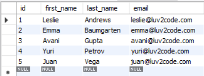
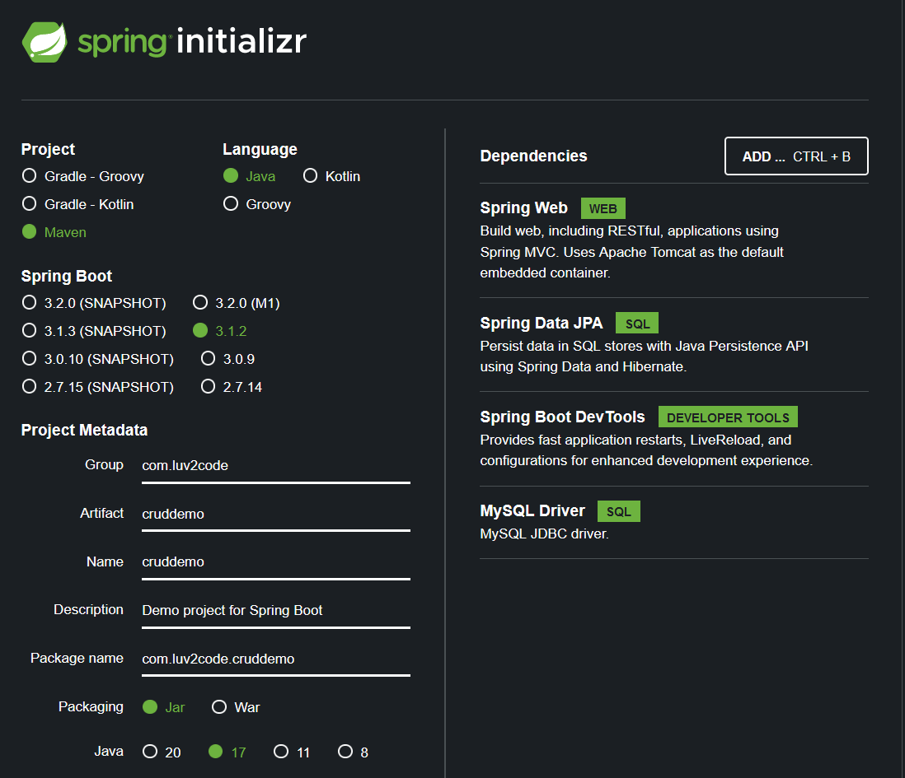

<link rel="stylesheet" href="styles.css">

# Project information
* I started this project on 23/07/2023 while working through [Chad Darby's Spring and Hibernate Course](https://www.udemy.com/course/spring-hibernate-tutorial/)
* You can find my main repo for this course [here](https://github.com/shivkumar98/Spring_and_Hibernate_Course)

# 🛠️ Project Requirements 🛠️

* For this project, I needed to create a RESTful API which connects to a database. Here are the requirements:
* We need to create a REST API for the Employee directory

* The API must be able to handle the following HTTP methods:

| HTTP Method                         | CRUD Action            |
| ---------------------------------   | ------------------------ |
| `POST` `/api/employees`             | Create a new employee  |
| `GET` `/api/employees`              | Retrieve employees     |
| `GET` `/api/employees/{employeeId}` | Retrieve an employee via ID |
| `PUT` `/api/employees/{employeeId}` | Update and employee via ID |


# 📈 Development Plan 📈

1) Set up database dev environment
2) Create Spring Boot project using Spring Initialzr
3) Get list of employees
4) Get single employee via ID
5) Create a new employee
6) Update an existing employee
7) Delete an existoing employee

* I have been provided sample data from [employee-directory.sql](/sample-data/employee-directory.sql)


# 📝 Project Commentary 📝

## 🟦 1 Setup Sample Data

* I install MySQL + Workbench, I connect to my Local Instance and run the SQL script:

```sql
CREATE DATABASE  IF NOT EXISTS `employee_directory`;
USE `employee_directory`;

--
-- Table structure for table `employee`
--

DROP TABLE IF EXISTS `employee`;

CREATE TABLE `employee` (
  `id` int NOT NULL AUTO_INCREMENT,
  `first_name` varchar(45) DEFAULT NULL,
  `last_name` varchar(45) DEFAULT NULL,
  `email` varchar(45) DEFAULT NULL,
  PRIMARY KEY (`id`)
) ENGINE=InnoDB AUTO_INCREMENT=1 DEFAULT CHARSET=latin1;

--
-- Data for table `employee`
--

INSERT INTO `employee` VALUES 
	(1,'Leslie','Andrews','leslie@luv2code.com'),
	(2,'Emma','Baumgarten','emma@luv2code.com'),
	(3,'Avani','Gupta','avani@luv2code.com'),
	(4,'Yuri','Petrov','yuri@luv2code.com'),
	(5,'Juan','Vega','juan@luv2code.com');
```

* I select the top row of the employee table:



## 🟦 2 Create the Project

* I use Spring Initialzr with the following config:



* I unzip the `cruddemo` folder and place it [here](/cruddemo/)

* I open up the pom.xml in IntelliJ