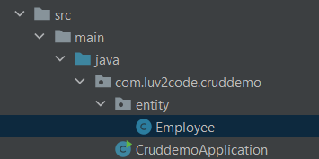
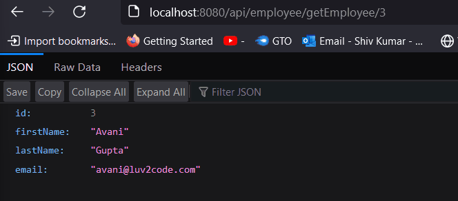
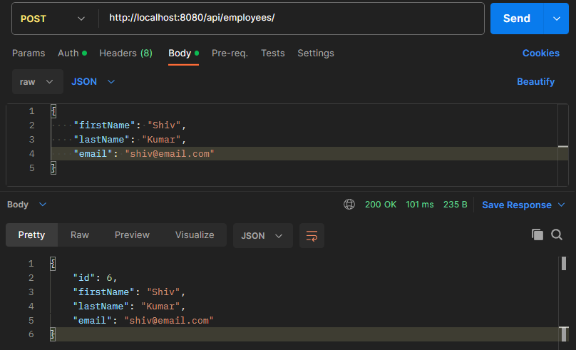
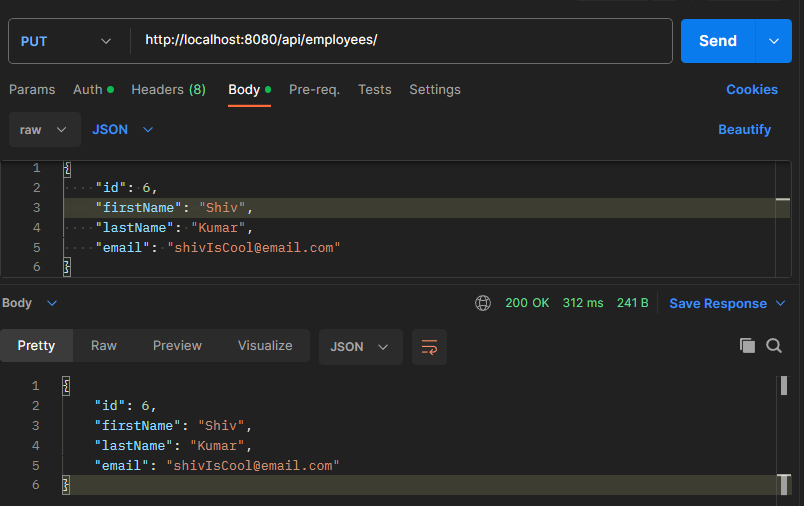
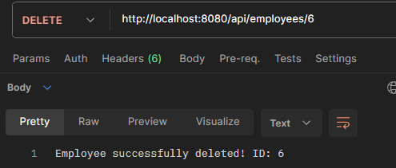

<link rel="stylesheet" href="styles.css">

# Project information
* I started this project on 23/07/2023 while working through [Chad Darby's Spring and Hibernate Course](https://www.udemy.com/course/spring-hibernate-tutorial/)
* You can find my main repo for this course [here](https://github.com/shivkumar98/Spring_and_Hibernate_Course)

# 🛠️ Project Requirements 🛠️

* For this project, I needed to create a RESTful API which connects to a database. Here are the requirements:
* We need to create a REST API for the Employee directory

* The API must be able to handle the following HTTP methods:

| HTTP Method                         | CRUD Action            |
| ---------------------------------   | ------------------------ |
| `POST` `/api/employees`             | Create a new employee  |
| `GET` `/api/employees`              | Retrieve employees     |
| `GET` `/api/employees/{employeeId}` | Retrieve an employee via ID |
| `PUT` `/api/employees/{employeeId}` | Update and employee via ID |


# 📈 Development Plan 📈

1) Set up database dev environment
2) Create Spring Boot project using Spring Initialzr
3) Get list of employees
4) Get single employee via ID
5) Create a new employee
6) Update an existing employee
7) Delete an existoing employee

* I have been provided sample data from [employee-directory.sql](/sample-data/employee-directory.sql)


# 📝 Project Commentary 📝

## 🟦 1 Setup Sample Data

* I install MySQL + Workbench, I connect to my Local Instance and run the SQL script:

```sql
CREATE DATABASE  IF NOT EXISTS `employee_directory`;
USE `employee_directory`;

--
-- Table structure for table `employee`
--

DROP TABLE IF EXISTS `employee`;

CREATE TABLE `employee` (
  `id` int NOT NULL AUTO_INCREMENT,
  `first_name` varchar(45) DEFAULT NULL,
  `last_name` varchar(45) DEFAULT NULL,
  `email` varchar(45) DEFAULT NULL,
  PRIMARY KEY (`id`)
) ENGINE=InnoDB AUTO_INCREMENT=1 DEFAULT CHARSET=latin1;

--
-- Data for table `employee`
--

INSERT INTO `employee` VALUES 
	(1,'Leslie','Andrews','leslie@luv2code.com'),
	(2,'Emma','Baumgarten','emma@luv2code.com'),
	(3,'Avani','Gupta','avani@luv2code.com'),
	(4,'Yuri','Petrov','yuri@luv2code.com'),
	(5,'Juan','Vega','juan@luv2code.com');
```

* I select the top row of the employee table:


## 🟦 2 Create the Project

* I use Spring Initialzr with the following config:


* I unzip the `cruddemo` folder and place it [here](/cruddemo/)

* I open up the pom.xml in IntelliJ

## 🟦 3 Spring Boot REST DAO

*  In order for Spring Boot Dev Tools to work properly I change the following settings:
1) Build, Execution, Deployment > Compiler > Tick Build Project Automatically
2) Advanced Settings > Tick Allow auto-make to start even if developed application is currently running

### 💻 Coding 💻

* I update the database configuration in [application.properties]():

```properties
# JDBC properties
spring.datasource.url=jdbc:mysql://localhost:3306/employee_directory
spring.datasource.username=root
spring.datasource.password=root
```

*  I create my `Employee` entity class in a new package called `entity`:



* I define the class as:

```java
@Entity
@Table(name="employee")
public class Employee {

    @Id
    @Column(name="id")
    @GeneratedValue(strategy = GenerationType.IDENTITY)
    private int id;
    @Column(name="first_name")
    private String firstName;
    @Column(name="last_name")
    private String lastName;
    @Column(name="email")
    private String email;

    public Employee() {}
    public Employee(String firstName, String lastName, String email){
        this.firstName = firstName; this.lastName=lastName; this.email=email;
    }

    // getters and setters and toString()   
}
```

* I create an interface and implementation in a new `dao` package:


* The interface is defined as:

```java
public interface EmployeeDAO {
  List<Employee> findAll();
}
```

* The implementation is defined as:

```java
@Repository
public class EmployeeDAOJpaImpl {
  private EntityManager entityManager;
  @Autowired
  public EmployeeDAOJpaImpl(EntityManager entityManager) {
    this.entityManager = entityManager;
  }
  @Override
  public List<Employeee> findAll() {
    TypedQuery<Employee> query = entityManager.createQuery("FROM Employee", Employee.class);
    List<Employee> list = query.getResultList();
    return list;
  }
}
```

* I then create my REST controller in a new `rest` package:


* We do a quick and dirty implementation where we inject the DAO directly into the controller:

```java
@RestController
@RequestMapping("api")
public class EmployeeRestController {
    private EmployeeDAO employeeDAO;
    public EmployeeRestController(EmployeeDAO employeeDAO) {
        this.employeeDAO = employeeDAO;
    }
    @GetMapping("employee")
    public List<Employee> findAll() {
        return employeeDAO.findAll();
    }
}
```

* I run the application and realise I made the following typos:
1) I missed the `@Id` annotation for the Id field on Employee
2) In the query, I typed: `entityManager.createQuery("FROM employee", Employee.class);`. I thought this was using the table name but its actually referencing the class!

* I run the application after fixing the above issues! I get the following result in my browser:


## 🟦 4 Spring Boot Service Layer

* We shall create a Service which will interact with the `EmployeeDAO`. A service layer allows us to create custom business logic and integrate data from multiple data sources.

* This is an implementation of the **Service Facade** design pattern - an object serves as a front-facing interface which masks more complex code. This improves readability and useability and provides more loosely coupled code!

* We will use `@Service` annotation  and spring will automatically register the service implementation thanks to component scanning!

### 💻 Coding 💻

* I create a new `service` package for my `EmployeeService` interface:


* The interface is defines as:

```java
public interface EmployeeService {
    List<Employee> findAll();
}
```

* I implemented this interface using `EmployeeServiceImpl` defined as:

```java
@Service
public class EmployeeServiceImpl {
  private EmployeeDAO employeeDAO;
  public EmployeeServiceImpl(EmployeeDAO employeeDAO) {
    this.employeeDAO = employeeDAO;
  }
  @Override
  public List<Employee> findAll() {
    employeeDAO.findAll();
  }
}
```

* I update the `EmployeeRestController` to use the above service:

```java
@RestController
@RequestMapping("api")
public class EmployeeRestController {

    private EmployeeService employeeService; // CHANGED FROM EmployeeDAO

    public EmployeeRestController(EmployeeService employeeService) {
        this.employeeService = employeeService;
    }
    @GetMapping("employee")
    public List<Employee> findAll() {
        return employeeService.findAll();
    }

}
```

* I run my Spring application and it all works:


## 🟦 5 Spring Boot DAO: Add, Update, Delete

* It's best practice to apply transactional boundaried at the serive layer and remove it from the DAO layer (if they exist)

### 💻 Coding 💻

* I update the `EmployeeDAO` interface to include the following methods:

```java
public interface EmployeeDAO {
    List<Employee> findAll();
    Employee findById(int id);
    Employee save(Employee employee);
    void deleteById(int id);
}
```

* I override the unimplemented methods in `EmployeeDAOJpaImpl`:

```java
@Repository
public class EmployeeDAOJpaImpl implements EmployeeDAO {
    private EntityManager entityManager;
    public EmployeeDAOJpaImpl(EntityManager entityManager){
        this.entityManager = entityManager;
    }
    public List<Employee> findAll() {
        TypedQuery<Employee> query = entityManager.createQuery("FROM Employee", Employee.class);
        List<Employee> list = query.getResultList();
        return list;
    }
    public Employee findById(int id) {
        TypedQuery<Employee> employee = entityManager.createQuery("From Employee WHERE id='" + id + "'", Employee.class);
        return  employee.getSingleResult();
    }
    public Employee save(Employee employee) {
        Employee dbEmployee = entityManager.merge(employee); // saves or updates depending on id
        return dbEmployee;
    }
    public void deleteById(int id) {
        Employee employee = entityManager.find(Employee.class, id);
        entityManager.remove(employee);
    }
}
```

* Note the `save()` method will only insert the employee into the DB if the ID is not 0! Otherwise it will just update the employee!


## 🟦 6 Spring Boot DAO: Add, Update, Delete

### 💻 Coding 💻

* I update the `EmployeeService` interface:

```java
public interface EmployeeService {
    List<Employee> findAll();
    Employee findById(int id);
    Employee save(Employee employee);
    void deleteById(int id);
}
```

* I update the `EmployeeServiceImpl` to implement the unimplemented methods and delegate the calls to `employeeDAO`

```java
@Service
public class EmployeeServiceImpl implements EmployeeService {

    private EmployeeDAO employeeDAO;
    public EmployeeServiceImpl(EmployeeDAO employeeDAO) {
        this.employeeDAO = employeeDAO;
    }
    public List<Employee> findAll() {
        return employeeDAO.findAll();
    }

    public Employee findById(int id) { // NEW METHOD
        return employeeDAO.findById(id);
    }

    @Transactional
    public Employee save(Employee employee) { // NEW METHOD
        return employeeDAO.save(employee);
    }

    @Transactional
    public void deleteById(int id) { // NEW METHOD
        employeeDAO.deleteById(id);
    }
}
```

* I apply `@Transactional` to all the methods which will modify the db in anyway!

## 🟦 7 Get Single Employee

* I create a new mapping in my REST controller which will retrieve a single employee using the employeeID:

* I create a new method in the `EmployeeRestController`:

```java
@GetMapping("getEmployee/{employeeId}")
public Employee getEmployeeId(@PathVariable int employeeId) {
  Employee employee = employeeService.findById(employeeId);
  if (employee == null) {
    throw new RuntimeException("Employee was not found");
  }
  return employee;
}
```

* I check if this endpoint is working! I get an obscure message and realise my implementation of `findById()` is incorrect in my `EmployeeDEOJpaImpl` class!

* I fix the method implementation:

```java
@Override
    public Employee findById(int id) {
        TypedQuery<Employee> employee = entityManager.createQuery("From Employee WHERE id="+id, Employee.class);
        return  employee.getSingleResult();
    }
```

* Now I rerun my application and everything is working as intended:



## 🟦 8 Add an Employee

* I create a new mapping in my controller which is a POST method to create and save a new employee:

```java
@PostMapping("/employees")
public Employee saveEmployee(@RequestBody Employee employee) {
    employee.setId(0); // just in case user supplied uneeded parameter
    Employee savedEmployee = employeeService.save(employee);
    return savedEmployee;
}
```

* I make a POST request in postman:



* A response was recieved so the post method works!!!

* I verify that the new employee appears in the database:


## 🟦 9 Update an Existing Employee

* I will create a new endpoint in my controller which will allow the user to update an existing employee and return the updated employee back!

```java
@PutMapping("/employees/")
public Employee updateEmployee(@RequestBody Employee employee) {
    // if employee exists then update, else save employee
    Employee updatedEmployee = employeeService.save(employee);
    return updatedEmployee;
}
```

* I verify that this new endpoint is working:



## 🟦 10 Delete an Employee

* I create a new endpoint which lets the user delete an employee via ID:

```java
@DeleteMapping("/employees/{employeeId}")
public String deleteEmployee(@PathVariable int employeeId) {
    if (employeeService.findById(employeeId) == null)
        throw new RuntimeException("Employee ID not found: "+employeeId);
    employeeService.deleteById(employeeId);
    return "Employee successfully deleted! ID: "+employeeId;
}
```

* I verify I can delete an employee:



## 🟦 11 Spring Data JPA

* PROBLEM: I want to create a new entity but I don't want to write a bunch of boiler-plate code.

* SOLUTION: Spring Data JPA provides CRUD elements  just by supplying the entity and the primary key!

* Spring Data JPA provides a `JpaRepository` interface which will provide the following methods: `findAll()`, `findById()`, `save()`, `deleteById()` and others!

### 💻 Coding 💻

* I refresh my SQL database by running the script from the sample data again!

* I create a copy of the `cruddemo` folder and rename it to `cruddemo_v2`

* I delete `EmployeeDAO` and `EmployeeDAOJpaImpl` from the `dao` package!

* I define a new interface - `EmployeeRepository`:

```java
public interface EmployeeRepository extends JpaRepository<Employee, Integer> {
}
```

* I then refactor `EmployeeServiceImpl` to use EmployeeRepository:

```java
@Service
public class EmployeeServiceImpl implements EmployeeService {
    private EmployeeRepository employeeRepository;
    public EmployeeServiceImpl(EmployeeRepository employeeRepository) {
        this.employeeRepository = employeeRepository; 
    }
    public List<Employee> findAll() {
        return employeeRepository.findAll(); 
    }
    public Employee findById(int id) {
        return employeeRepository.findById(id).orElseThrow(()->new RuntimeException("Did not find employee"));
    }
    // @Transactional - no longer needed
    public Employee save(Employee employee) {
        return employeeRepository.save(employee);
    }
    // @Transactional - no longer needed
    public void deleteById(int id) {
         employeeRepository.deleteById(id);
    }
}
```

* I run the application, and all the CRUD operations are behaving normally!


## 🟦 12 Spring Data REST

* Spring Data REST leverages the existing `JpaRepository` subclasses and expose the endpoints for free!

* Spring Data REST will create the endpoints using the entity name, making it lowercase and making it pluralised. `Employee` -> `employees`

* All we need to do this is update the Maven POM file with the following dependency:

```xml
<dependency>
    <groupId>org.springframework.boot</groupId>
    <artifactId>spring-boot-starter-data-rest</artifactId>
</dependency>
```

### 🎭 HATEOAS 🎭

* Spring Data REST endpointsd are HATEOAS compilant, i.e. the meta-data of the responses will be compiant

* E.g. the REST response from `GET /employee/3`:

```json
{
    "firstName": "Shiv",
    "lastName": "Kumar",
    "email": "shiv@email.com",
    "_links": {
        "self": {
            "href": "http://localhost:8080/employees/3"
        },
        "employee": {
            "href": "http://localhost:8080/employees/3"
        }
    }
}
```
* If the REST response is a collection, then the meta data will contain page size, total elements, pages etc. E.g.:

```json
{
    "_embedded": {
        "employees": [
            {
                "firstName": "Shiv",
                ...
            },
            ...
        ]
    },
    "page": {
        "size": 20,
        "totalElements": 5,
        "totalPages": 1,
        "number": 0
    }
}
```

### 💻 Coding 💻

* I refresh my database and make a clone of `crumdemo_v2` called `crumdemo_v3`

* I update the `pom.xml` to include the following dependency:

```xml
<dependency>
    <groupId>org.springframework.boot</groupId>
    <artifactId>spring-boot-starter-data-rest</artifactId>
</dependency>
```

* I'll delete my `service` and `rest` packages of my project!

* I run the application and I am able to retrieve the employees information by going to `localhost:8080/employees`

* I can update the endpoint locations by specifying some properties in `application.properties`:

```properties
# Spring Data REST properties
spring.data.rest.base-path=/magic-api
```

* Now we have endpoints like `http://localhost:8080/magic-api/employees`

## 🟦 12 Spring Data REST Config and Sorting

### ⚙️ Configuration ⚙️

* Spring Data REST does not handle complex pluralised names for entities. I.e `Goose` becomes `gooses`

* We have a solution to this issue. E.g. suppose we wanted our endpoints to contain `members` and not `employees`. We can use the `@RespositoryRestResource`:

```java
@RepositoryRestResource(path="members")
public interface EmployeeRespository extends JpaRepository<Employee, Integer> {
}
```

### 📄 Paging 📄

* By default, Spring REST will return 20 elements per page. The pages can be accessed via the URL (e.g. page 1 is `http://localhost:8080/magic-api/employees?page=0`)

* We can override the number of elements, and page number limits via the following properties:

| Name                                 | Description          |
| ------------------------             | ---------------------|
|`spring.data.rest.base-path`          | Base path used to expose repository resources |
| `spring.data.rest.default-page-size` | Default size of pages`  |
| `spring.data.rest.max-page-size`     | Maximum size of pages  |

### 📊 Soring 📊

* We can sort by the property names of the entity by specifying a paramater in the URL.

* E.g. to sort the json by last name, descending we would use:

```url
http://localhost:8080/magic-api/employees?sort=lastName,desc
```

* If we wanted to sory by last name, then first name:

```url
http://localhost:8080/magic-api/employees?sort=lastName,firstName,asc
```